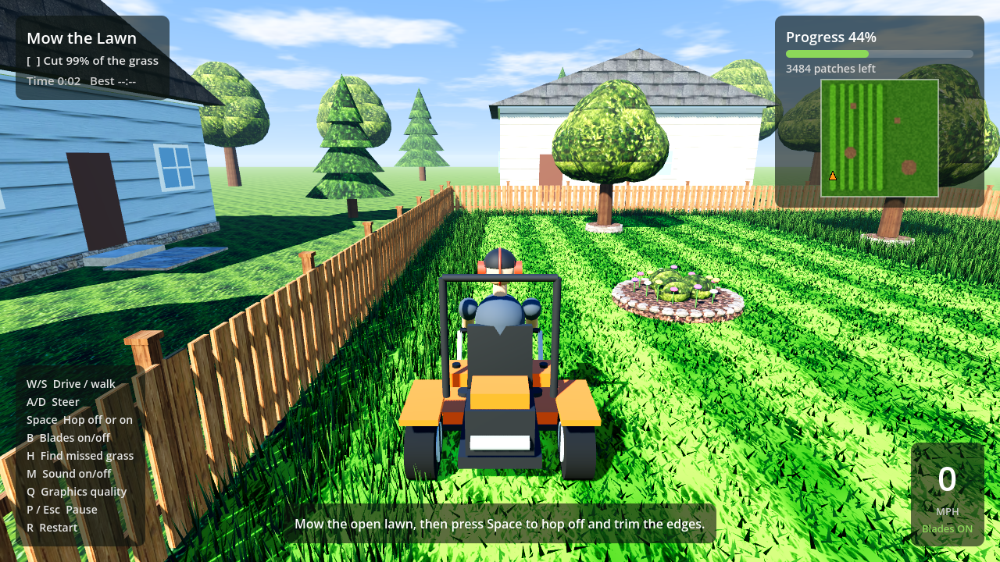

# Lawn Wrangler

Version 1.0.0

A relaxing 3D landscaping game. Ride an orange mower across the open lawn,
hop off to trim along the fence and around the trees and flower beds with a
weed eater, and cut 99% of the grass to finish. Built with Godot 4 and
GDScript, and played in the browser.

[Play Lawn Wrangler](https://ElSpaniard97.github.io/lawn-wrangler/)



## Features

- A zero-turn style riding mower with a chase camera, and a landscaper who
  walks with a weed eater.
- A dressed yard: houses next door, a picket fence with posts and rails,
  shade trees and pines, and flower beds edged with stones.
- Engine, blade, weed eater and grass rustle sounds, and a chime when you
  finish. M turns the sound off and on.
- A minimap of the lawn showing what is cut and where you are.
- The mower's blade is narrower than its body, so the strip along the fence
  and the edges of beds and tree rings need the weed eater.
- Light and dark stripes like a real lawn: mowing a line one way and back
  the other leaves alternating shades. Cut grass leaves short stubble and
  throws clippings, and tall grass sways in the breeze.
- Thick grass of thin, varied blades, and a sky with fair-weather clouds.
- Bright summer lighting with a warm sun, soft shadows, light haze and a
  ring of distant trees.
- Photo textures: grass detail on the lawn, wood fence, sided houses with
  shingled roofs and stone chimneys, mulch beds, stone edging, leafy trees,
  and a paver patio and concrete driveway.
- Missed-patch highlight with H, switched on automatically at 95%.
- Progress, patches left, speed, time and your best time on screen.
- Pause with P / Esc, and an automatic pause when the game loses focus.
- Best time saved in your browser.
- Plays on phones and tablets with on-screen buttons that appear on touch
  screens.
- Low, Medium and High graphics quality (Q to switch, remembered between
  visits). Phones start on Low; F3 shows frame rate and draw calls.

## Controls

| Key | Action |
| --- | --- |
| W / S or Up / Down | Drive or walk forward and back |
| A / D or Left / Right | Steer |
| Space | Hop off the mower, or back on when you are next to it |
| B | Mower blades on or off |
| H | Highlight grass you missed |
| M | Sound off or on |
| Q | Graphics quality: Low, Medium or High |
| F3 | Show frame rate and draw calls |
| P / Esc | Pause or resume |
| R | Restart the yard |

Click inside the game before using the keyboard. On a phone or tablet, tap
the on-screen buttons instead: arrows to steer, GO and BACK to drive or
walk, and HOP, BLADES, FIND, SOUND, PAUSE and RESTART. A browser with
WebGL 2 is required.

## Work on the game

Install [Godot 4.7.2-stable](https://godotengine.org/download/archive/4.7.2-stable/)
(the standard build, not .NET), then open the `godot/` folder in it and press
Play. From the command line, with `godot` on your path:

```bash
godot --headless --path godot --import
godot --headless --path godot --script res://tests/run_tests.gd
godot --headless --path godot --export-release Web ../site/play/index.html
cp web/index.html web/credits.html site/
python3 -m http.server 9000 --directory site
```

Then open http://localhost:9000. Download Godot only from godotengine.org or
its GitHub releases page.

## How it is published

Every push to `main` runs the tests, exports the game to `site/play/` and
deploys `site/` to GitHub Pages. Pull requests run the tests only. CI
downloads the exact Godot version and checks its SHA-512 sums in
`.github/scripts/setup-godot.sh` before using it; to upgrade Godot, change the
version and both sums there, and the version noted in `godot/project.godot`.

## Project layout

- `godot/scenes/yard.tscn` and `godot/scripts/yard.gd`: builds the yard,
  handles hopping off and on, keys, and finishing.
- `godot/scripts/lawn_grid.gd`: which grass is cut. The one source of truth
  for cutting, progress and the stripes.
- `godot/scripts/lawn_view.gd`: draws the ground stripes and the chunked
  grass clumps, and the missed-patch highlight.
- `godot/shaders/grass.gdshader`: grass colour, breeze sway and highlight.
- `godot/shaders/sky.gdshader`: the sky gradient, sun glow and clouds.
- `godot/scripts/mower.gd`, `godot/scripts/walker.gd`: driving, walking and
  cutting.
- `godot/scripts/chase_camera.gd`: camera that follows whoever you control.
- `godot/scripts/run_state.gd`: timer, pause and the saved best time.
- `godot/scripts/hud.gd`: on-screen panels, messages and the minimap.
- `godot/scripts/models.gd`: the landscaper, the walk cycle and the shared
  shape helpers the mower and scenery are built from.
- `godot/scripts/sounds.gd`: synthesizes every sound when the yard loads.
- `godot/scripts/settings.gd`: saved quality and sound settings, checked
  before use.
- `godot/scripts/touch_controls.gd`: the on-screen buttons for touch
  screens.

Everything that never moves (houses, trees, fence, beds) and most of the
mower and landscaper are merged into a few meshes when the yard loads
(`Models.bake`), which cut the meshes drawn each frame from 359 to 18.

All models and sounds are generated in code; the game loads no model or
audio files. Scenery uses the photo textures in `godot/textures/`, projected
from world space so they work on the baked meshes, and the lawn's ground uses
`godot/shaders/ground.gdshader` to add grass detail under the stripes.
- `ASSET_LICENSES.md`: where each texture came from.
- `godot/tests/run_tests.gd`: headless tests, run in CI before every deploy.
- `web/index.html`: the landing page that frames the game.
- `web/credits.html`: credits and the Godot Engine license.
- `RELEASE.md`: release checklist and how to roll back.

## Credits

Made by Zeke with [Godot Engine](https://godotengine.org) 4.7.2 (MIT license).
Every model and sound is generated in code. The photo textures come from a
texture sheet Zeke supplied; see [ASSET_LICENSES.md](ASSET_LICENSES.md). The full Godot license notice is on the game's
[credits page](https://ElSpaniard97.github.io/lawn-wrangler/credits.html).

## Roadmap

The full plan is in the project's improvement plan document.

| Phase | Status |
| --- | --- |
| Security and CI hardening | Done |
| 0. 3D export spike | Done |
| 1. Graybox gameplay: weed eater, hop off/on, tests ported | Done |
| 2. Grass polish: stubble, sway, clippings, gap-free cutting | Done |
| 3. Visual slice: models, sound, landscaping, minimap (all built in code) | Done |
| 4. Optimize and QA: fewer draw calls, quality presets, touch controls | Done |
| 5. Release 1.0: credits, release checklist, rollback plan | Done |
| 6. Realism pass: lighting, thicker grass, real stripes, photo textures | Done |
| 7. Graphics upgrade toward the target image: grass and camera, desktop build, mower, bigger yard, HUD | In progress |

The original Python/pygame version was replaced by the Godot version. Its
last release is commit `cbd462d`; see [RELEASE.md](RELEASE.md) for rolling
back.

Ideas for after 1.0: a second yard, bronze/silver/gold medal times, and a
daily random yard layout.
